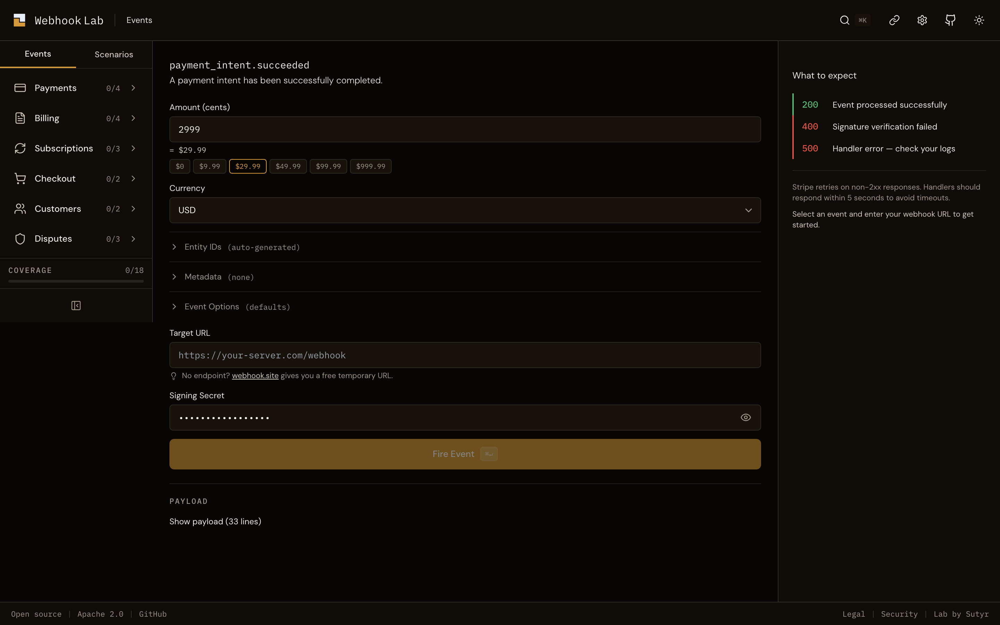

<div align="center">
  
</div>

# Webhook Lab

Open-source Stripe webhook testing. Generate events, sign them, fire them at your endpoint. Zero auth, zero Stripe account.

[](https://github.com/sutyr/webhook-lab)
[](LICENSE)
[](https://www.typescriptlang.org/)
[](packages/events/package.json)

## What it does

Webhook Lab generates structurally correct Stripe webhook events, signs them with Stripe-compatible HMAC-SHA256 signatures, and fires them at your endpoint. Test your webhook handler against 18 event types and 5 billing lifecycle scenarios with customizable entity IDs, decline codes, metadata, and card details. Built for developers who need to verify their Stripe integration without triggering real events.

## Quick Start

### Browser

Visit [lab.sutyr.com](https://lab.sutyr.com). No installation, no signup, no Stripe account required.

### npm

```bash
npm install @sutyr/webhook-lab
```

```typescript
import { paymentIntentPaymentFailed, sign } from '@sutyr/webhook-lab';

const event = paymentIntentPaymentFailed({
  declineCode: 'insufficient_funds',
  amount: 4999,
  currency: 'usd',
});

const signature = sign(event, 'whsec_your_signing_secret');

await fetch('https://your-server.com/webhook', {
  method: 'POST',
  headers: {
    'Content-Type': 'application/json',
    'Stripe-Signature': signature,
  },
  body: JSON.stringify(event),
});
```

## Features

- **18 event types** across payments, billing, subscriptions, checkout, customers, and disputes
- **5 scenario presets** with correlated entity IDs across multi-step billing lifecycles
- **Stripe-compatible signing**: HMAC-SHA256 matching Stripe's `constructEvent()` algorithm
- **Customizable**: entity IDs, metadata, card details, decline codes, livemode, API version
- **Decline code accuracy**: correct `code` vs `decline_code` distinction at every layer
- **Shareable URLs**: copy a link, teammate sees the exact same configured event
- **Export**: copy as cURL, TypeScript, or Python
- **Replay**: re-fire the same event to test handler idempotency
- **Response history**: compare responses across fires, restore previous configurations
- **Coverage tracking**: see which event types you've tested this session
- **756 tests**: schema validation, SSRF protection, signature compatibility, entity correlation
- **Zero runtime dependencies** in library packages
- **Zero telemetry**: no analytics, no tracking, no cookies; only functional localStorage for preferences

## Schema Accuracy

Every generated event is validated against Stripe's API documentation. The test suite includes:

- **370 event tests**: field names, types, ID prefixes (`pi_`, `ch_`, `in_`, `sub_`, `cus_`, `dp_`), enum values, nested object shapes
- **115 integration tests**: structural contracts, entity ID correlation across scenario steps, sign-then-verify round-trips for all 18 event types, end-to-end verification against Stripe's official SDK
- **38 signature tests**: Stripe compatibility vectors, boundary tolerance (300s), malformed header rejection, unicode payload round-trips
- **233 web tests**: API routes, SSRF protection (IPv4, IPv6, IPv4-mapped IPv6, redirect-follow), rate limiting, input validation, export formatting

The decline code distinction is tested at three layers. `payment_intent.payment_failed` with `insufficient_funds` produces `decline_code: 'insufficient_funds'` on `last_payment_error`. With `expired_card`, the field `decline_code` is absent. Not null, absent. This matches Stripe's actual behavior and catches a common handler bug.

## Events

| Category | Event Type | Description |
|----------|-----------|-------------|
| Payments | `payment_intent.succeeded` | Payment completes successfully |
| Payments | `payment_intent.payment_failed` | Payment attempt fails with decline code |
| Payments | `charge.succeeded` | Charge is captured |
| Payments | `charge.refunded` | Full or partial refund issued |
| Billing | `invoice.created` | Invoice generated for subscription |
| Billing | `invoice.paid` | Invoice payment succeeds |
| Billing | `invoice.payment_failed` | Invoice payment attempt fails |
| Billing | `invoice.payment_succeeded` | Invoice payment confirmation |
| Subscriptions | `customer.subscription.created` | New subscription starts |
| Subscriptions | `customer.subscription.updated` | Subscription status or plan changes |
| Subscriptions | `customer.subscription.deleted` | Subscription canceled |
| Checkout | `checkout.session.completed` | Checkout session finishes |
| Checkout | `checkout.session.expired` | Checkout session times out |
| Customers | `customer.created` | New customer created |
| Customers | `customer.updated` | Customer details changed |
| Disputes | `charge.dispute.created` | Customer disputes a charge |
| Disputes | `charge.dispute.updated` | Dispute evidence or status changes |
| Disputes | `charge.dispute.closed` | Dispute resolved (won or lost) |

## Scenarios

| Scenario | Steps | Description |
|----------|:-----:|-------------|
| Subscription Happy Path | 7 | Customer created, subscription started, invoice paid |
| Failed Payment Dunning | 7 | Invoice fails, subscription goes past_due, retries exhaust, canceled |
| Checkout Flow | 3 | Checkout session completes, payment succeeds, charge created |
| Dispute Lifecycle | 4 | Charge disputed, evidence submitted, dispute resolved |
| Refund Flow | 2 | Successful charge followed by full refund |

All scenarios use correlated entity IDs: the same customer, subscription, invoice, and charge IDs appear across every step in the sequence.

## Self-Hosting

```bash
git clone https://github.com/sutyr/webhook-lab.git
cd webhook-lab
pnpm install
pnpm dev
```

Open `http://localhost:3000`. Set `WEBHOOK_LAB_ALLOW_PRIVATE=true` in your environment to fire events to localhost endpoints.

## Contributing

See [CONTRIBUTING.md](CONTRIBUTING.md). All contributors must agree to the [CLA](CLA.md).

Schema accuracy bugs (our payload doesn't match Stripe's actual behavior) are treated as P0. We aim to fix within 24 hours.

## License

Webhook Lab is open source, licensed under the [Apache License 2.0](LICENSE).

The Sutyr billing orchestration platform is a separate proprietary product. Use of Webhook Lab does not grant any license to Sutyr's proprietary software, trade secrets, or platform services.

This project is not developed, maintained, endorsed, or sponsored by Stripe, Inc. Stripe is a registered trademark of Stripe, Inc. Event schemas are derived from Stripe's publicly available [API documentation](https://docs.stripe.com/api).